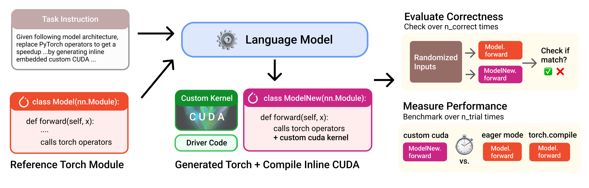

# KernelBench: Can LLMs Write Efficient GPU Kernels? [ICML '25]
[arXiv](https://arxiv.org/html/2502.10517v1) | [blog post](https://scalingintelligence.stanford.edu/blogs/kernelbench/) | [HuggingFace Dataset](https://huggingface.co/datasets/ScalingIntelligence/KernelBench) | 

## Versions
The huggingface dataset is updated to v0.1.
- [v0.1](https://github.com/ScalingIntelligence/KernelBench/tree/v0.1) - Latest version (also main branch)
- [v0](https://github.com/ScalingIntelligence/KernelBench/tree/v0) - Original Release

A benchmark for evaluating LLMs' ability to generate efficient GPU kernels


<!-- See [blog post](https://scalingintelligence.stanford.edu/blogs/kernelbench/) and [arXiv paper](https://arxiv.org/html/2502.10517v1) for more details. -->

## 👋 Task Description
We structure the problem for LLM to transpile operators described in PyTorch to CUDA kernels, at whatever level of granularity it desires to.


We construct KernelBench to have 4 Levels of categories:
- **Level 1 🧱**:  Single-kernel operators (100 Problems)
    The foundational building blocks of neural nets (Convolutions, Matrix multiplies, Layer normalization)
- **Level 2 🔗**:  Simple fusion patterns (100 Problems)
    A fused kernel would be faster than separated kernels (Conv + Bias + ReLU, Matmul + Scale + Sigmoid)
- **Level 3 ⚛️**:  Full model architectures (50 Problems)
    Optimize entire model architectures end-to-end (MobileNet, VGG, MiniGPT, Mamba) 
- **Level 4 🤗**:  Level Hugging Face 
    Optimize whole model architectures from HuggingFace

## ⚖️ Evaluation
#### Methodology
To evaluate model-generated kernels, we need to check if they:
- **is correct ✅**: check against reference torch operators `n_correctness` times on randomized inputs.
- **is performant ⏱️**: compare against reference torch operators `n_trial` times to measure speedup between runtimes.

Check out `src/eval.py` for details on how we implement correctness check and timing. 

We provide a convenient script `scripts/run_and_check.py` to evaluate one single sample source code against a reference source code, check correctness and compute speedup. You can use this to evaluate a model-generated kernel. 

#### Overall Benchmark Metric

Since we need to capture **both** correctness and performance, we define a metric `fast_p`: fraction of tasks that are both correct and have a speedup greater than threshold `p`; speedup is computed as the ratio of PyTorch reference wall-clock time to generated kernel time.

Some examples to illustrate this metric that filters based on speedups:
* `fast_1` is the fraction of tasks that LM-generated kernels are both correct and **faster** than PyTorch baseline
* `fast_2` is the fraction of tasks that LM-generated kernels are both correct and **at least 2x faster** than PyTorch baseline
* `fast_0` is the fraction of tasks that LM-generated kernels are **correct**. (same as correctness rate)

You can increase speedup threshold `p` to make the task more challenging.

#### Compute Overall Benchmark Performance

We provide a script `scripts/greedy_analysis.py` to compute the overall benchmark performance. 
Since we need to capture **both** correctness and performance, we use a metric `fast_p`: fraction of tasks that are both correct and have a speedup greater than threshold `p`; speedup is computed as the ratio of PyTorch reference wall-clock time to generated kernel time.

<!-- TODO: update to provide fast_p measurement script -->

## 🔍 Directory Structure
We organize the repo into the following structure:
```
KernelBench/
├── assets/
├── KernelBench/ # Benchmark dataset files
├── src/ # KernelBench logic code
│   ├── unit_tests/  
│   ├── prompts/
│   ├── ....
├── scripts/ # helpful scripts to run the benchmark
├── results/ # baseline times across hardware 
├── runs/ # where your runs will be stored
```

## 🔧 Set up
```
conda create --name kernel-bench python=3.10
conda activate kernel-bench
pip install -r requirements.txt
pip install -e . 
```

To call LLM API providers, set your `{INFERENCE_SERVER_PROVIDER}_API_KEY` API key.

Running and profiling kernels require a GPU. 
If you don't have GPU available locally, you can set up [Modal](https://modal.com/). Set up your modal token after creating an account by running `modal token new`. Then, use the `generate_and_eval_single_sample_modal.py` script.

## 🚀 Usage
### Run on a single problem 
It is easier to get started with a single problem. This will fetch the problem, generate a sample, and evaluate the sample.

```
# for example, run level 2 problem 40 from huggingface

python3 scripts/generate_and_eval_single_sample.py dataset_src="huggingface" level=2 problem_id=40

# dataset_src could be "local" or "huggingface"
# add .verbose_logging for more visbility
```

### Run on all problems 

```
# 1. Generate responses and store kernels locally to runs/{run_name} directory
python3 scripts/generate_samples.py run_name=test_hf_level_1 dataset_src=huggingface level=1 num_workers=50 server_type=deepseek model_name=deepseek-chat temperature=0

# 2. Evaluate on all generated kernels in runs/{run_name} directory
python3 scripts/eval_from_generations.py run_name=test_hf_level_1 dataset_src=local level=1 num_gpu_devices=8 timeout=300

# If you like to speedup evaluation, you can use parallelize compilation on CPUs before getting to evluation on GPUs
# add build_cache=True and num_cpu_workers=<num_cpu_workers> to the command
```
### Analyze the eval results to compute Benchmark Performance
We provide `scripts/benchmark_eval_analysis.py` to analyze the eval results to compute success rate, timing metric, and overall benchmark performance  `fast_p`. 

```
python3 scripts/benchmark_eval_analysis.py run_name=test_hf_level_1 level=1 hardware=L40S_matx3 baseline=baseline_time_torch
```
If you are using a different hardware, you can generate the baseline time with `scripts/generate_baseline_time.py` script.
We provide some reference baseline times a variety of NVIDIA GPUs across generations in `results/timing`, but we recommend you to generate your own baseline time for more accurate results (cluster power, software version, all affects timing result). See `results/timing/README.md` for more details.

### Multi-Turn Framework
We have also releaed the test-time framework [Caesar](https://github.com/simonguozirui/caesar) that are used in the multi-turn / iterative refinement experiments in our paper. You can use or modify this framework for high-throughput test-time scaling (both sequential and parallel) targeting KernelBench problems. 

## 🛣️ Upcoming Roadmap
- [ ] Triton Variant (To be merged)
- [ ] Easy to use CoLab Notebook Example
- [ ] Push button flow on Modal / Cloud Provider 
- [ ] Integrate with more frameworks, such as [ThunderKittens](https://github.com/HazyResearch/ThunderKittens)
- [ ] Add backward pass
- [ ] Integrate with toolchains such as NCU
See Issues for the ongoing roadmap and directions.


## 🔍 Known Usage
- [NVIDIA](https://developer.nvidia.com/blog/automating-gpu-kernel-generation-with-deepseek-r1-and-inference-time-scaling/) - Automating GPU Kernel Generation with DeepSeek-R1 and Inference Time Scaling
- [METR](https://metr.org/blog/2025-02-14-measuring-automated-kernel-engineering/) - Measuring Automated Kernel Engineering
- [Sakana AI](https://sakana.ai/ai-cuda-engineer/) - AI Cuda Engineer
- [Project Popcorn](https://www.youtube.com/watch?v=mdDVkBeFy9A) - Triton Support for KernelBench, Data Scaling + SFT'd Kernel LLM
- [Kevin](https://cognition.ai/blog/kevin-32b) - Kevin-32B: Multi-Turn RL for Writing CUDA Kernels
- [Simple Test-Time Search](https://scalingintelligence.stanford.edu/blogs/fastkernels/) - by @anneouyang

If you are using KernelBench, we love to hear more about it!

## 🪪 License
MIT. Check `LICENSE.md` for more details.


## Citation
```bibtex
@misc{ouyang2025kernelbenchllmswriteefficient,
      title={KernelBench: Can LLMs Write Efficient GPU Kernels?}, 
      author={Anne Ouyang and Simon Guo and Simran Arora and Alex L. Zhang and William Hu and Christopher Ré and Azalia Mirhoseini},
      year={2025},
      eprint={2502.10517},
      archivePrefix={arXiv},
      primaryClass={cs.LG},
      url={https://arxiv.org/abs/2502.10517}, 
}
```
